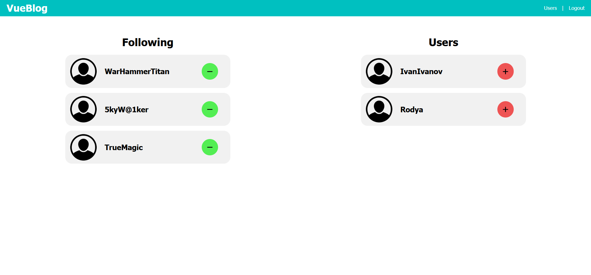

# VUE-BLOG

### About
Blog application using Vue + Vuex


*Your page*


*Your page (small screen)*


*Users page*


*Users page (small screen)*


*Page of other user*


*Edit user page*


*Registration page*


*Login*

### Install packages
```
npm install
```

### Start application
```
npm run dev
```